- [Visit a Job](#visit-a-job)
  - [Conservation Genetics](#conservation-genetics)
  - [Set Up Your System](#set-up-your-system)
    - [**Following the steps below, you will do some comparative genomics of your favorite animal and a few of it's close relatives.**](#following-the-steps-below-you-will-do-some-comparative-genomics-of-your-favorite-animal-and-a-few-of-its-close-relatives)
- [Activity 1 - Find Genomes](#activity-1---find-genomes)
  - [Step 1: Find the reference genome of your favorite animal](#step-1-find-the-reference-genome-of-your-favorite-animal)
    - [a. Go to **https://www.ncbi.nlm.nih.gov/**](#a-go-to-httpswwwncbinlmnihgov)
    - [b. Put your favorite species (species name or common name should work) in the search bar and click ***Search***](#b-put-your-favorite-species-species-name-or-common-name-should-work-in-the-search-bar-and-click-search)
    - [c. If there is a reference genome, that will be right at the top!](#c-if-there-is-a-reference-genome-that-will-be-right-at-the-top)
    - [d. Click ***Browse Genomes*** from the species page or ***Genomes*** from search results](#d-click-browse-genomes-from-the-species-page-or-genomes-from-search-results)
    - [e. For the genome with the green checkmark, copy the **GenBank** number.](#e-for-the-genome-with-the-green-checkmark-copy-the-genbank-number)
    - [f. Go to the command line and download the genome.](#f-go-to-the-command-line-and-download-the-genome)
  - [Step 2: Find some friends to compare your animal to](#step-2-find-some-friends-to-compare-your-animal-to)
    - [a. Go back to the species page.](#a-go-back-to-the-species-page)
    - [b. Clicking ***Browse Taxonomy*** takes you to the Taxonomy Browser.](#b-clicking-browse-taxonomy-takes-you-to-the-taxonomy-browser)
    - [Option 1: Be Picky](#option-1-be-picky)
      - [c. Browse a bit. If there's a number in the *Genome* column, there's a genome you can download.](#c-browse-a-bit-if-theres-a-number-in-the-genome-column-theres-a-genome-you-can-download)
      - [d. When you find a species you want to compare, click the number. That will take you to a Genome page like in Step 1e. Copy the **GenBank** number with the green checkmark.](#d-when-you-find-a-species-you-want-to-compare-click-the-number-that-will-take-you-to-a-genome-page-like-in-step-1e-copy-the-genbank-number-with-the-green-checkmark)
      - [e. Go to the command line and download the genome.](#e-go-to-the-command-line-and-download-the-genome)
    - [Option 2: Everyone in the Pool](#option-2-everyone-in-the-pool)
      - [c. if you want to skip all clicking, copying, and pasting, go straight to the command line and download everything in a given taxon.](#c-if-you-want-to-skip-all-clicking-copying-and-pasting-go-straight-to-the-command-line-and-download-everything-in-a-given-taxon)
  - [Step 3: Make your references list](#step-3-make-your-references-list)
  - [Step 4: What's in a name?](#step-4-whats-in-a-name)
- [Activity 2 - How similar is their DNA?](#activity-2---how-similar-is-their-dna)
  - [Step 1: Sketch](#step-1-sketch)
  - [Step 2: Compare Genomes](#step-2-compare-genomes)
  - [Step 3: Draw a Tree](#step-3-draw-a-tree)
    - [Set Up Your Data](#set-up-your-data)
    - [Make Your Tree](#make-your-tree)
    - [Relabel Tree](#relabel-tree)
    - [Visualize your tree.](#visualize-your-tree)
- [Activity 3 - Synteny](#activity-3---synteny)
  - [What is Synteny? With Cookies!](#what-is-synteny-with-cookies)
  - [Step 1: Compute synteny blocks](#step-1-compute-synteny-blocks)
  - [Step 2: Genomes Indexes](#step-2-genomes-indexes)
  - [Step 3: Visualize Synteny](#step-3-visualize-synteny)
    - [Make It Pretty!](#make-it-pretty)
    - [*TROUBLESHOOTING*: if plotting is the only part that didn't work](#troubleshooting-if-plotting-is-the-only-part-that-didnt-work)

# Visit a Job 

## Conservation Genetics

Learn about genomics projects using big data and do some bioinformagic of your own with an activity from the command line. No prior experience in genomics, coding, or bioinformatics is required.

## Set Up Your System

[Conda](https://docs.conda.io/projects/conda/en/latest/user-guide/install/index.html) is a program that helps manage programs. I have pre-installed all the programs you'll need for this exercise. If you're doing this at home, the programs installed in this conda environment are:

- [ncbi_datasets](https://anaconda.org/channels/conda-forge/packages/ncbi-datasets-cli/overview)
- [ntSynt](https://github.com/BirolLab/ntSynt)
- [ntSynt-viz](https://github.com/BirolLab/ntSynt-viz)
- [Mash](https://mash.readthedocs.io/en/latest/)
- [FastMe](https://www.atgc-montpellier.fr/tool/fastme-2-0/)

```sh
conda env create -f bioinformagic.yml
conda activate bioinformagic 
```

### <span style="color: purple">**Following the steps below, you will do some comparative genomics of your favorite animal and a few of it's close relatives.**</span>

# Activity 1 - Find Genomes

## Step 1: Find the reference genome of your favorite animal

### a. Go to **https://www.ncbi.nlm.nih.gov/**

### b. Put your favorite species (species name or common name should work) in the search bar and click ***Search***

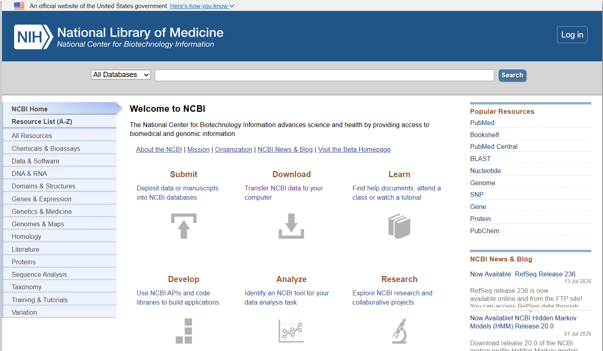

### c. If there is a reference genome, that will be right at the top!
   - If it doesn't, find a closely related species following [Step 2](#step-2-find-some-friends-to-compare-your-animal-to).

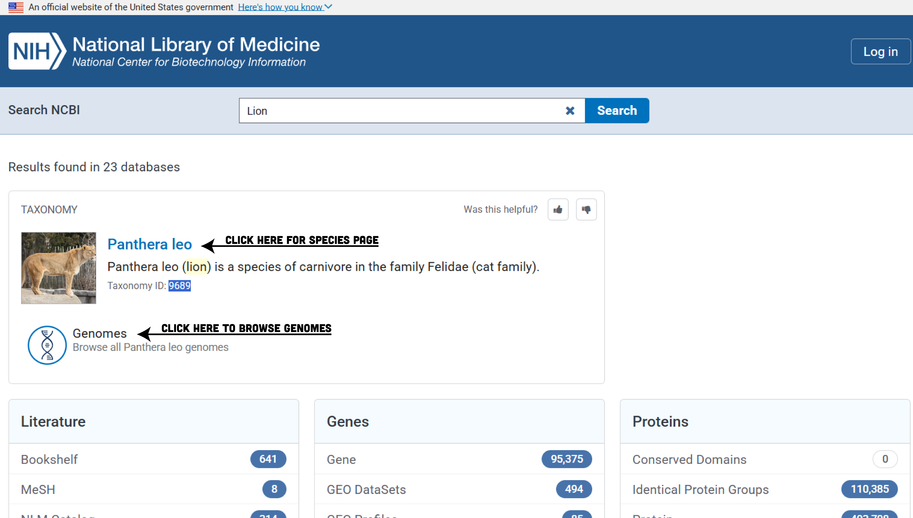

### d. Click ***Browse Genomes*** from the species page or ***Genomes*** from search results

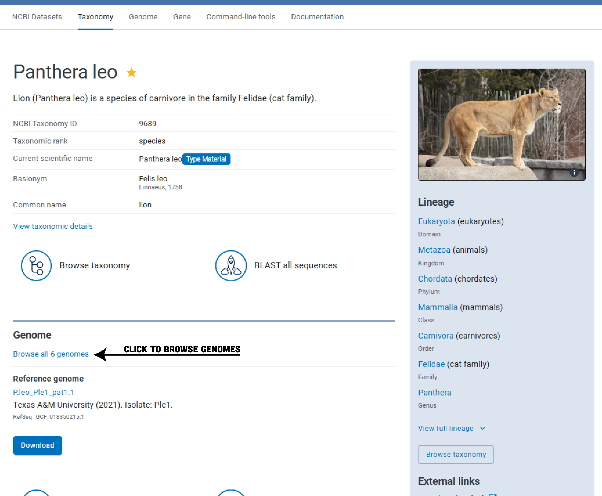

### e. For the genome with the green checkmark, copy the **GenBank** number. 
   - It should be "GCA" followed by nine numbers + ".1"

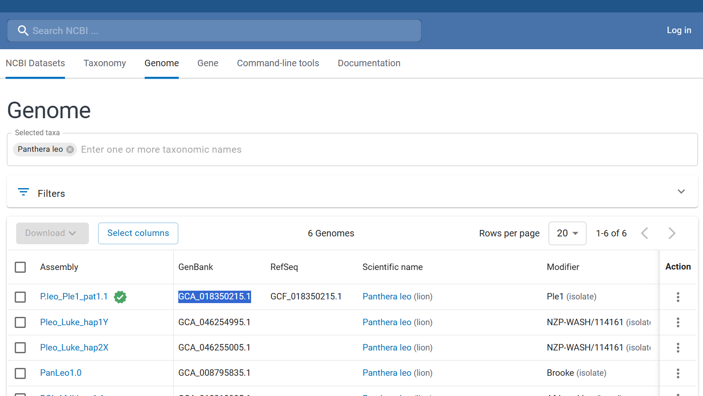

### f. Go to the command line and download the genome.

```sh
datasets download genome accession [GENBANK_NUMBER] --include genome
```

- this also works using the taxon number

```sh
datasets download genome taxon [NUMBER] --reference --include genome
```

- This downloads a .zip file with the information requested from NCBI. You then have to unpack it to get to the genome. All datasets downloads are saved as ncbi_dataset.zip. 
  - Run `bash helper_scripts/unpack_ncbi-datasets.sh` to unzip, find, and move the genome, then delete all the extra information we don't need right now. 
    - To look at the script and see how it works, run `cat helper_scripts/unpack_ncbi-datasets.sh`.

>***HELPFUL TIP:*** push the up arrow ↑ while on the command line to find lines you've already run!

## Step 2: Find some friends to compare your animal to

### a. Go back to the species page.

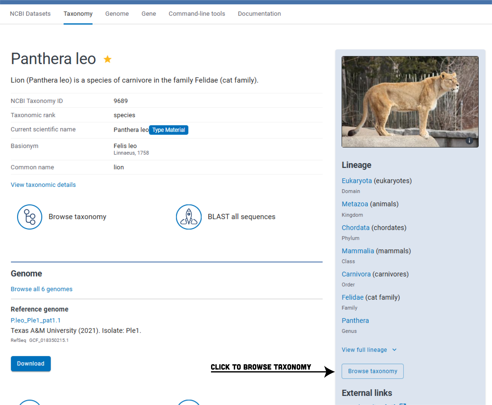

### b. Clicking ***Browse Taxonomy*** takes you to the Taxonomy Browser.

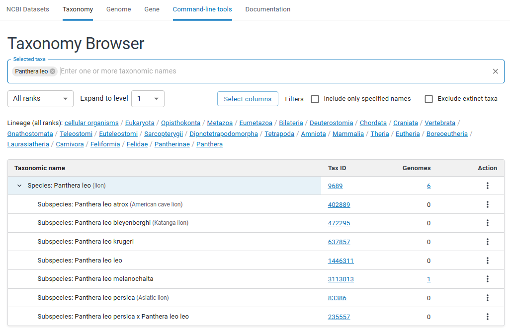

### Option 1: Be Picky

#### c. Browse a bit. If there's a number in the *Genome* column, there's a genome you can download.

  - Does your species have any close relatives at the subspecies level? 
    - If not, go up one in the lineage.

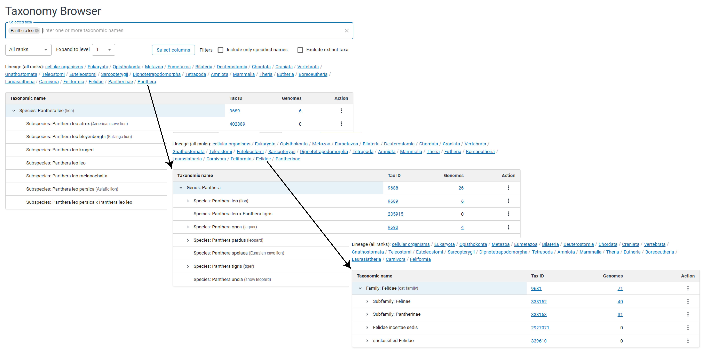

#### d. When you find a species you want to compare, click the number. That will take you to a Genome page like in [Step 1e](#e-for-the-genome-with-the-green-checkmark-copy-the-genbank-number). Copy the **GenBank** number with the green checkmark. 

#### e. Go to the command line and download the genome.

```sh
datasets download genome accession [GENBANK_NUMBER] --include genome
```

>**THINGS TO CONSIDER while browsing:**
> - On the Genome page, check "Level": Chromosome > Scaffold > Contig 
> - Also on the Genome page, check "Scaffold": Avoid genomes with scaffolds in the millions! The smaller the number the better. A good genome can be in the thousands, a great genome in the hundreds, and a perfect genome will be the exact number of chromosomes of the species (not many of those exist). 
> - Don't browse too high in the taxonomy tree from your target species. The higher you browse the more divergent they'll be and, while it might still work, it will take MUCH longer.

### Option 2: Everyone in the Pool

#### c. if you want to skip all clicking, copying, and pasting, go straight to the command line and download everything in a given taxon.

```sh
datasets download genome taxon [Name/Number] --reference --include genome
```

>**<span style="color: orange">WARNING</span>:** without doing some browsing you are leaving it to the Gods. You might download 1 or 100. I recommend still looking around a bit before committing to Option 2.

## Step 3: Make your references list

You should now have a solid collection of genomes to compare. You have two options again. Make a list of everything you collected yourself or you can do it dynamically on the command line.

We're here to learn some bioinformagic so let's give the command line a try!

`find` is a great tools for compiling a list of files with particular criteria. We want to `find` all files in the current directory (`.`) with a file `-name` that has `*.fna` then `-printf` it on separate lines (`%f\n`) and write it  (`>`) to a file called `Refrences.list`.

```sh
find . -name "*.fna" -printf "%f\n" > References.list
```

This is assuming all your reference genomes have the file ending `.fna` (they usually do if they were downloaded from NCBI).

The result might be something like this:

```txt
GCF_018350215.1_P.leo_Ple1_pat1.1_genomic.fna
GCF_024362965.1_ASM2436296v1_genomic.fasta
GCA_024362865.1_leopard2_amari_p.ctg.hic.fasta_genomic.fna
GCA_038088395.1_Nimr1_genomic.fna
GCF_018350195.1_P.tigris_Pti1_mat1.1_genomic.fna
```

This will be your input file for [Activity 3](#activity-3---synteny).

## Step 4: What's in a name?

Genome file names aren't always the most informative. Plotting in `ntSynt` allows for you to name your genomes whatever you want in the final plot by providing a name conversion file. This is a tab-separated file with the genome filename and the name you want on the final plot.

I've created a nice little program that will create one for you from your References.list.

```sh
bash helper_scripts/make-name-conversion.sh References.list
```

The script goes through your list and asks what you'd like each genome to be called on your plot with a prompt. ***I recommend short names without spaces.***

This results in a file called NameConversion.tsv, that will look something like this:

```txt
GCF_046562875.1_mPanOnc1_haplotype_2_genomic.fna	Jaguar
GCF_018350195.1_P.tigris_Pti1_mat1.1_genomic.fna	Tiger
GCF_023721935.1_Puncia_PCG_1.0_genomic.fna	SnowLeopard
GCF_024362965.1_ASM2436296v1_genomic.fna	Leopard
GCF_018350215.1_P.leo_Ple1_pat1.1_genomic.fna	Lion
```

# Activity 2 - How similar is their DNA?

Using the genomes we just collected, we are going to figure how closely related they are by looking at how similar their DNA is.

## Step 1: Sketch

This step summarizes each genome into a small sets of data for fast similarity comparisons into a .msh file.

```sh
mash sketch *.fna
```

>Takes ~10 minutes for five 2-3G genomes.

## Step 2: Compare Genomes

Now we're going to take those sketches and estimate the genetic distance between genomes.

```sh
mash triangle *.msh > mash_distances.tsv
```

This results in a triangle of pairwise distances (i.e. the percent that two genomes are different, or divergent, from one another).

```sh
cat mash_distances.tsv
```

```txt
  5			
GCF_018350195.1_P.tigris_Pti1_mat1.1_genomic.fna				
GCF_018350215.1_P.leo_Ple1_pat1.1_genomic.fna	0.0103562			
GCF_023721935.1_Puncia_PCG_1.0_genomic.fna	0.00785531	0.0101041		
GCF_024362965.1_ASM2436296v1_genomic.fna	0.0081558	0.00655869	0.00853806	
GCF_046562875.1_mPanOnc1_haplotype_2_genomic.fna	0.0084995	0.00838426	0.0090861	0.006248
```

>This is a simplified table of the data above:

||Tiger|Lion|SnowLeopard|Leopard|Jaguar
|:-:|:-:|:-:|:-:|:-:|:-:|
Tiger|0					
Lion|1.04%|0				
SnowLeopard|0.79%|1.01%|0
Leopard|0.82%|0.66%|0.85%|0		
Jaguar|0.85%|0.85%|0.91%|0.62%|0


So, according to this example, lion and tiger are 0.0103562 or 1% divergent! This divergence information will come in handy later in [Activity 3](#activity-3---synteny).

## Step 3: Draw a Tree

***Skip this step if you downloaded less than 4 species!***

Phylogenetic trees are a great representation of genetic similarily. Each species is on it's own branch connecting to trunks that represent common relatives. [FastMe](https://www.atgc-montpellier.fr/tool/fastme-2-0/) makes simple phylogenetic trees from genetic distances, like those calculated with [Mash](#step-2-compare-genomes), but only for 4 or more species.

### Set Up Your Data

The Mash triangle isn't quite the right format for the next step, so we have to do some conversion (a common problem in biology. Everyone has their favorite format, but which to use when isn't standardized)...

To convert the Mash triangle we created in [Activity 2](#step-2-compare-genomes) into a phylip alignment file needed to calculate a tree, run: 

```py
python helper_scripts/mash_to_fastme.py mash_distances.tsv mash_fastme.phy
```

Now your data should look like this:

```txt
5
GCF_018350195.1_P.tigris_Pti1_mat1.1_genomic.fna  0.00000000 0.01035620 0.00785531 0.00815580 0.00849950
GCF_018350215.1_P.leo_Ple1_pat1.1_genomic.fna  0.01035620 0.00000000 0.01010410 0.00655869 0.00838426
GCF_023721935.1_Puncia_PCG_1.0_genomic.fna  0.00785531 0.01010410 0.00000000 0.00853806 0.00908610
GCF_024362965.1_ASM2436296v1_genomic.fna  0.00815580 0.00655869 0.00853806 0.00000000 0.00624800
GCF_046562875.1_mPanOnc1_haplotype_2_genomic.fna  0.00849950 0.00838426 0.00908610 0.00624800 0.00000000
```

### Make Your Tree

```sh
fastme -i helper_scripts/mash_fastme.phy -o mash_tree.nwk
```

### Relabel Tree

The labels right now are crazy long. But do not fret! This is fixable with a quick script using our [NameConversion.tsv](#step-4-whats-in-a-name) file we already created:

```sh
cp mash_tree.nwk tree.nwk && while read FULL SHORT; do sed -i "s/${FULL:0:10}/${SHORT}/g" mash_tree.nwk; done < NameConversion.tsv
```

This script takes our NameConversion.tsv and uses `sed` to relabel each branch of the tree by finding the truncated name (the first 10 characters of the genome file name, i.e. column 1, `FULL:0:10`) and replacing it with our "desired" name (i.e. column 2, `SHORT`).

### Visualize your tree.

```sh
nw_display tree.nwk
```

```txt
                 /--------------------------------------------+ SnowLeopard
 /---------------+
 |               \-----------------------------------------+ Tiger
 |
=+      /------------------------+ Leopard
 +------+
 |      \----------------------------------------------+ Lion
 |
 \------------------------------------+ Jaguar

 |----------|----------|----------|----------|----------|------
 0      0.001      0.002      0.003      0.004      0.005
```

# Activity 3 - Synteny

**Synteny is when different species share the exact same order of genes along their DNA.**

Think of a specie's genome as being a cook book. Two similar cook books can have the same or similar recipes (a.k.a. genes), that may or may not appear in the same order in the cook book. To see HOW close the genomes are, we want to find where they're the same!

Synteny = finding the exact same sequence of recipes, in the same order, inside different cookbooks.

  - The Chromosomes are chapters
  - The Genes are the individual recipes
  - Synteny is the pages where the recipes match

## What is Synteny? With Cookies!

>One cookbook has 6 cookie recipes from pages 130-136: Chocolate Chip, Peanut Butter, White Chocolate Macadamia, Funfetti, Double Chocolate Chunk, and Oatmeal Raisin.

>Another cookbook has 6 cookie recipes from pages 144-150: Chocolate Chip, Peanut Butter, Snickerdoodle, Double Chocolate Chunk, Funfetti, and Oatmeal Raisin. 

Syntheny is the recipes that are the same, in the same order. So the cookie recipe synteny would look something like this:

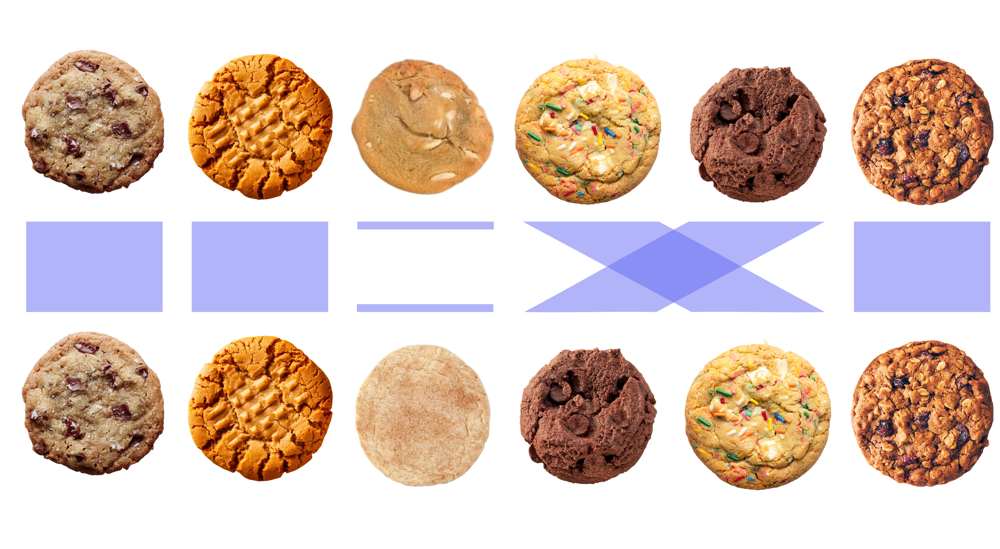

Those cookies within the chapter looks like this:

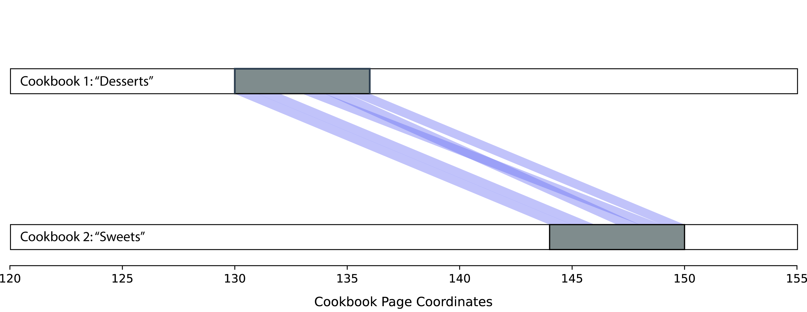

Synteny across the whole cookbook might look something like this:

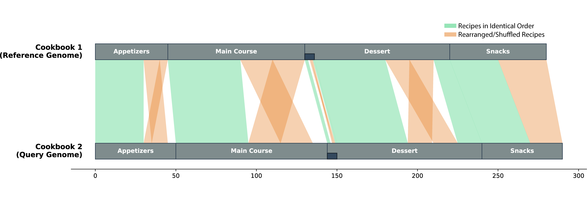

We are going to use the genmes from [Activity 1](#activity-1---find-genomes) and the information we learned from [Activity 2](#activity-2---how-similar-is-their-dna) to find the synteny between your favorite species and a their friends.

## Step 1: Compute synteny blocks

**This step takes the longest.**

Now we are starting the heavy lifting. The program `ntSync` finds the similarities between a list of reference genomes then generates beautiful plots to visualize synteny.

```sh
ntSynt --fastas_list References.list -d 1
```

This is where you can use what you learned in [Activity 2](#step-2-compare-genomes). The -d parameter is the expected divergence used to tune the algorithm and helps ntSynt distinguish true matches from random matches. I recommend setting this to somewhere close to the highest number from your [mash triangle](#step-2-compare-genomes). 

*But don't worry if you're not sure what to put for -d. Underestimating you might lose some sensitivity and overestimating might lose specificity, but for this activity, it'll be fine.*

## Step 2: Genomes Indexes

For quicker computing, the genomes all need to be indexed. Indexing is essentially making a map.

nySynt should have indexed your genomes during [Step 1](#step-1-compute-synteny-blocks). But if it didn't or you need to redo your indexes, you can index all files in the current directory using:

```sh
for fasta in *.fna; do samtools faidx "$fasta"; done
```

For plotting our synteny, we need to create a similar file to our References list but with the index files. To write the path of all .fai files in the directory to an fais.txt file, run:

```sh
find . -name "*.fai" -printf "%f\n" > fais.txt
```

## Step 3: Visualize Synteny

First thing's first, double check you have all the things!

- REQUIREMENTS: 
	- Output from [Activity 3, Step 1](#step-1-compute-synteny-blocks) : `--blocks` ntSynt.k24.w1000.synteny_blocks.tsv 
	- Output from [Activity 3, Step 2](#step-3-genomes-indexes) : `--fais` fais.txt 	
- OPTIONAL:
  - `--name-conversion` changes the labels from the default file names to your desired name
    - Output from [Activity 1, Step 4](#step-4-whats-in-a-name) : `--name-conversion` NameConversion.tsv
  - `--tree` will order your plot based on a phylogenetic tree
  	- Output from [Activity 2, Step 3](#relabel-tree) : `--tree` tree.nwk
  - `--target-species` puts your favorite species at the top and compares all others to it.
  - `--normalize` will flip the orientation of chromosomes/scaffolds of the comparison genomes so that their direction matches the orientation of your favorite species.

### Make It Pretty!

```bash
ntsynt_viz.py --blocks ntSynt.k24.w1000.synteny_blocks.tsv --fais fais.txt --format pdf --name_conversion NameConversion.tsv --normalize --tree tree.nwk --target-genome $FAVORITE_SPECIES
```

At the end of it all, this is what you get!

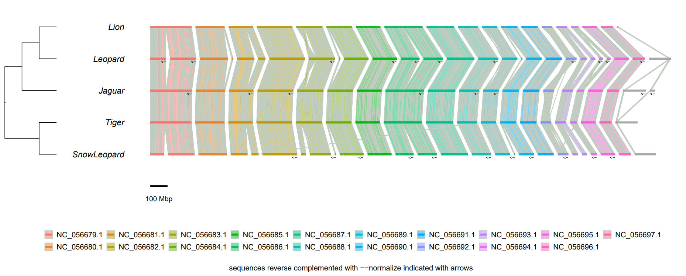

---

### *TROUBLESHOOTING*: if plotting is the only part that didn't work

Sometimes things don't always go as planned. When I ran this the first time, the actual plot didn't work but all the intermediate files worked just fine. If that happens to you, running the Rscript independently should work if you have all packages installed. 

```bash
Rscript /home/ubuntu/USS/caitlin/Programs/ntSynt-viz-1.0.0/bin/ntsynt_viz_plot_synteny_blocks_ribbon_plot.R -s ntSynt-viz_ribbon-plot.sequence_lengths.sorted.tsv -l ntSynt-viz_ribbon-plot.links.tsv -c ntSynt-viz_ribbon-plot.chrom-paint-feats.tsv --tree ntSynt-viz_ribbon-plot_est-distances.nwk --order ntSynt-viz_ribbon-plot_est-distances.order.tsv --format pdf --height 20 --width 50 --ratio 0.1 -p ntSynt-viz_ribbon-plot_ribbon-plot
```

